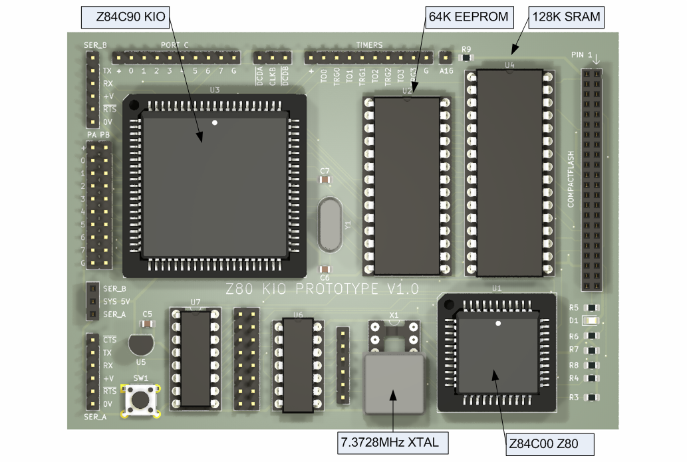

# Zilog Z80 Curiosity Board #2 - The KIO Version

After my attempt to build a Z80 board met with reasonable success, I set my sights on a possible RetroDuino-Z80 board. This design is the pathfinder project with that goal in mind.

I wanted to have serial, parallel I/O and timer capability but aware of the space limitations, I decided to investigate the use of the Zilog Z80 KIO chip, or Z84C90 KIO as it's called.

This is a beast of a chip. It comes in a PLCC84 package which requires a big chunk of board space. The KIO combines the PIO, SIO  and CTC chips into one package.

The design still makes use of the PLCC44 Z80 CPU that I used previously.

## Description

The aim of this project is to provide the groundwork for a possible RetroDuino-Z80 board along the lines of my [RetroDuino-8085](https://github.com/MarkD833/RetroDuino-8085) board.

I'm hoping that this design can also run CP/M and I will be using Grant Searles excellent [web page](http://searle.x10host.com/cpm/index.html) as my starting point.

## Design

The design is fairly straightforward, using a 128Kb SRAM from my stash as well as a 64Kb EEPROM for non volatile storage. Only the lower 64Kb of SRAM is currently accessible.

I studied other designs that I came across and liked a concept that I came across whereby on startup, the whole of the ROM was copied into RAM and then the ROM disabled. The hardware was configured so that the ROM and the RAM both occupied the same 64Kb, but initially any read accessed would go to the ROM and any write accesses would go to the RAM. Once the ROM was copied into RAM (at the same addresses), the ROM would be disabled giving full read/write access to the RAM and the Z80 would continue to execute instructions as if nothing had happened.

The design uses simple logic chips to handle the address decoding, as well as the disabling of the ROM etc.

# The board layout

This is an annotated 3D view of the board generated by Kicad as it stands at v1.0.

# Software

I adapted Dave Dunfields MONZ80 monitor program to work with this board. MONZ80 can be found on [Dave's website](https://dunfield.themindfactory.com/dnldsrc.htm) as part of the MONITORS.ZIP file. There is no documentation for the monitor but most of the commands are self explanatory.

The monitor code needs a slight tweek to reflect the address of the SIO registers. My modified version of MONZ80 is in the code folder and has been edited to allow assembly using the free online assembler at [ASM80.COM](https://asm80.com) - select the Z80 CPU.

The code folder includes the assembler files to run CP/M from [Grant Searles web site](http://searle.x10host.com/cpm/index.html) but configured to assemble using the ASM80 online assembler. I've also included my instructions for loading CP/M onto the board, which are almost identical to Grants instructions.

# Known errors

* Nothing so far. 

# Conclusions

The board works as I had hoped it would. I need to develop routines for SPI and also I2C , but sadly not how I had hoped due to the interrupt issue mentioned above.

## License

This project is licensed under the GNU General Public License v3.0 - see the LICENSE.md file for details
